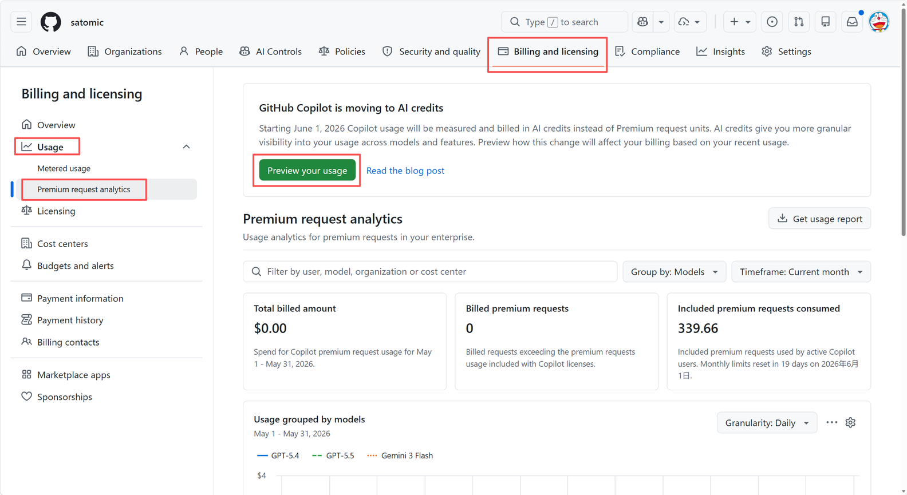
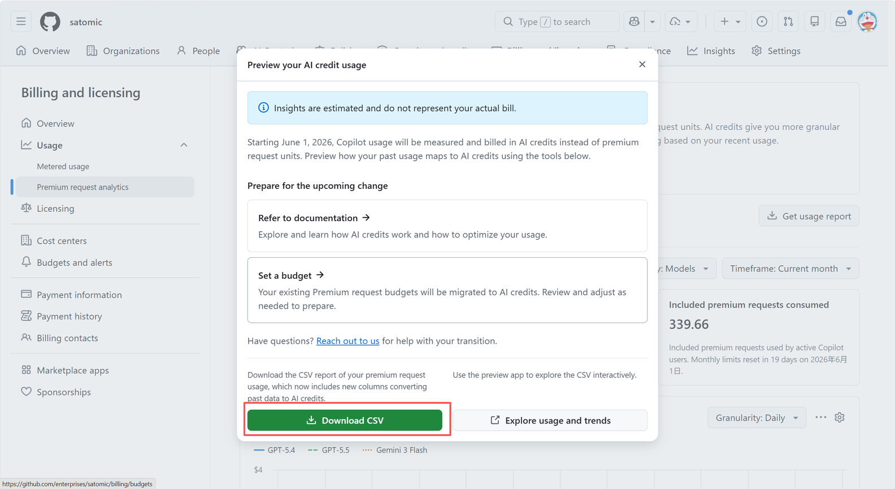
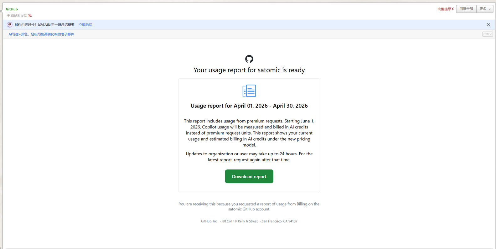
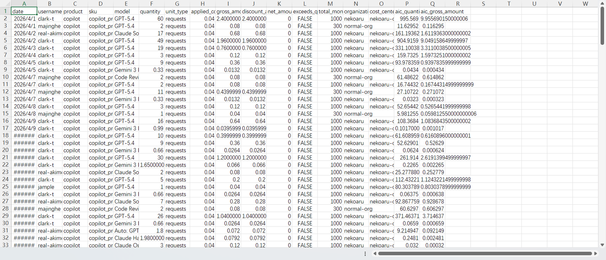

# 3. Steps (手順)

利用状況レポートを取得し、UBB (usage-based billing: 使用量ベース課金) 移行後の見積コストを把握するまでの 3 ステップです。

## 3.1 Go to the billing page (課金ページに移動する)

GitHub にアクセスし、対象 Enterprise または Organization の **billing ページ** を開きます。次のいずれかの導線からアクセスできます。

- Enterprise ホームページ
- Billing overview ページ
- Premium request analytics ページ

## 3.2 Open the billing preview (Billing Preview を開く)

ページ上部に表示されるバナー内の **`Preview your usage`** ボタンをクリックします。

## 3.3 Download the usage report (利用状況レポートをダウンロードする)

Billing Preview ページが開くので、**`Download CSV`** をクリックします。

GitHub はレポートを **非同期で生成** します。レポートの準備が完了すると、リクエストを行った管理者宛てに **メールで通知** されます。

CSV ファイルをダウンロードしたら、Excel またはその他の表計算ツールで開きます。

このレポートは **ユーザー × モデル × 日付** 単位で生成されます。各行は、ある日に特定のユーザーが特定のモデルを使用した分の集計値を表します。

特に注目すべきは、次の 2 つのフィールドです。

| フィールド | 説明 |
| --- | --- |
| `aic_quantity` | 消費した AI Credits (AI クレジット) の数量 |
| `aic_gross_amount` | UBB 適用時の見積コスト (USD) |

---

| ナビゲーション | |
| --- | --- |
| ← 前へ | [2. Prerequisites](02-prerequisites.md) |
| → 次へ | [4. Online Assessment](04-online-assessment.md) |
