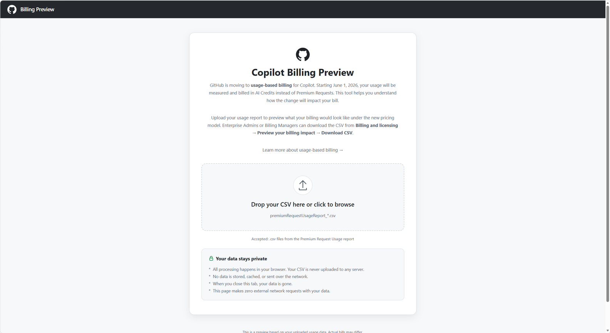

# 4. Online Assessment (オンライン分析)

[**Copilot Billing Preview**](https://copilot-billing-preview.github.com/) のページを開くと、ブラウザ上で利用状況の分析チャートを参照でき、全体傾向や分布を視覚的に把握できます。

このアプリを使うことで、以下のような観点を確認できます。

- どのユーザーの利用量が多いか
- どのモデルが多くの AI Credits を消費しているか
- どの日付で明確なコストスパイクが発生しているか
- 現在のバジェット (予算) を調整する必要があるか

## アプリに関する重要な注意事項

- **Billing Preview は GitHub Pages にデプロイされた静的 Web アプリ** です。
- **外部サービスとは通信せず**、すべての処理はユーザーのブラウザ上 (クライアントサイド) で行われます。アップロードしたデータは **ユーザーのコンピューターから外に出ません**。
- 古いフォーマットのレポート (例: AIC 列を含まない PRU のみのもの) は **受け付けられません**。

---

| ナビゲーション | |
| --- | --- |
| ← 前へ | [3. Steps](03-steps.md) |
| → 次へ | [5. Features of the Copilot Billing Preview app](05-features.md) |
