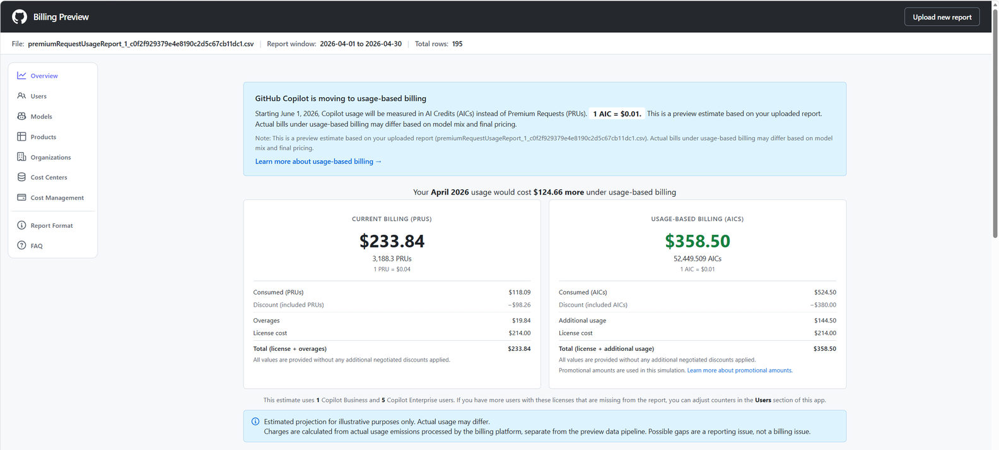
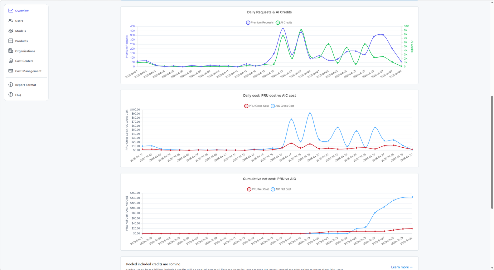
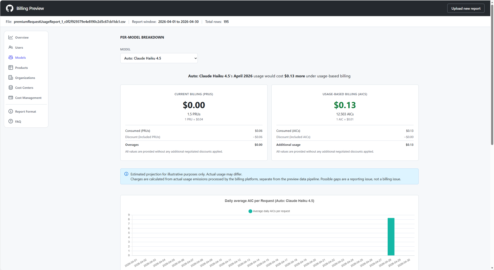

# 5. Features of the Copilot Billing Preview app (Copilot Billing Preview アプリの機能)

アプリ左側のパネルから複数のビューを切り替えて分析できます。

## 5.1 Overview (概要ビュー)

Overview ビューは「**何が変わるのか? (What changed?)**」という疑問に対するトップレベルの答えを提供します。

このビューで、ユーザーは次のことが行えます。

- **現行課金 (PRUs: Premium Request Units)** と **AI Credits ベース課金 (AICs)** のサマリカードを比較する
- 日次チャートを確認し、差分が「**安定的な利用量**」「**いくつかのスパイク**」「**月末超過パターン**」のいずれに由来するかを切り分ける
- **累積ネットコスト (cumulative net cost)** チャートを使って、2 つの課金モデルがどの時点から乖離し始めるかを説明する
- 予測請求額が増加する場合、画面下部の **推奨される次のステップ (recommended next steps)** に目を通す

## 5.2 Assessment Example (分析例)

以下は、分析ビューの実例です。

---

| ナビゲーション | |
| --- | --- |
| ← 前へ | [4. Online Assessment](04-online-assessment.md) |
| → 次へ | [6. Disclaimers](06-disclaimers.md) |
